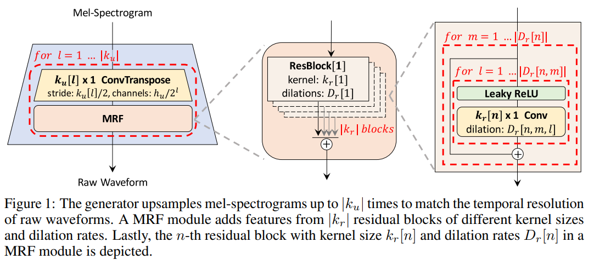
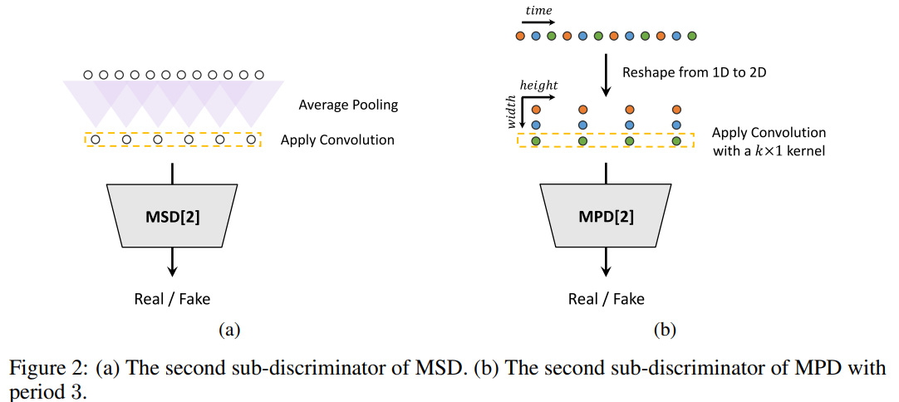

# NV project

Implementation of [HiFi-GAN: Generative Adversarial Networks for
Efficient and High Fidelity Speech Synthesis](https://arxiv.org/pdf/2010.05646.pdf)

<p align="center">
  
  
</p>


## Installation guide
Run
```shell
pip install -r requirements.txt
```
to install all libs.

## Train running guide
In order to recreate results, use `hifi.json`:
```shell
python3 train.py -c hw_nv/configs/hifi.json 
```

## Test running guide
Download model checkpoint with `setup.sh`:
```shell
chmod +x setup.sh & ./setup.sh
```
Run test with
```shell
python3 test.py \
   -c default_test_model/hifi.json \
   -r default_test_model/model.pth
```
it will create `output` directory and write test audios.
